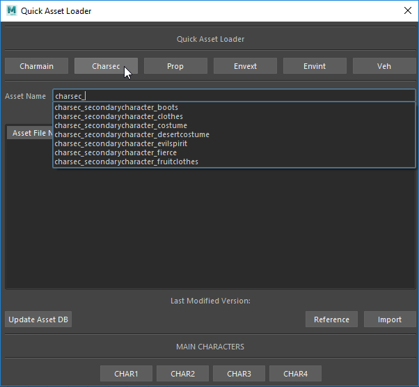

# quickAssetLoader

This project is an exercise to explore the auto-completion feature in QT as you are type.
It is designed to work runtime in Maya for quick loading and reference assets based on a text file that can be potentially
be populated by any DB

## Features 

* Fast autocompletion while typing the asset name
* placeholder methods to connect to any asset DB
* Quick buttons to load most frequently used assets
* Easy to use UI designed to avoid the unoptimized maya (or Shotgun) file management system
* Supports Maya 2017,2018, 2019

## Installation

1. Download and unzip this repository in your C:\Users\[USERNAME]\Documents\maya\scripts\quickAssetLoader

2. Turn in a shelf button from main.py script contained in this repo.

3. Click the icon on the shelf to run.

## License

The quickAssetLoader is free to use in production under the GNU Lesser General Public License v3.0.
For more information please click [here](LICENSE).

## Support

Comments, suggestions and bug reports are welcome.

Feel free to submit any issues with the error message and a detailed step by step process of how you got the error in [github issues](https://github.com/Maximvm89/quickAssetLoader/issues)
